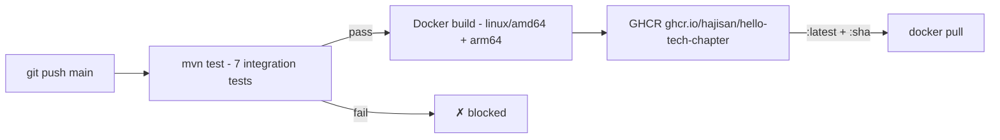

# Hello Tech Chapter

REST API bygget som praktikansøgning til Tech Chapter 2026.

Serverer talentprofiler og dokumenter over et JSON API med Swagger UI og en statisk frontend der henter dynamisk fra API'et.

Bygget med **Java 21 + Spring Boot 3**, dokumenteret med **Swagger UI** og deployeret via **GitHub Actions → GHCR**.

## Stack

- Java 21 + Spring Boot 3.5
- springdoc-openapi (Swagger UI)
- JUnit 5 + Spring Boot Test (MockMvc integration tests)
- Docker (multi-stage build, non-root user, HEALTHCHECK, multi-platform)
- GitHub Actions CI/CD → GHCR (test gate før build)

## Kør med Docker

```bash
docker pull ghcr.io/hajisan/hello-tech-chapter:latest
docker run -p 8080:8080 ghcr.io/hajisan/hello-tech-chapter:latest
```

| URL | Beskrivelse |
|-----|-------------|
| `http://localhost:8080` | Frontend |
| `http://localhost:8080/swagger-ui.html` | Swagger UI |
| `http://localhost:8080/api-docs` | OpenAPI JSON |
| `http://localhost:8080/actuator/health` | Health check |

## CI/CD Pipeline



## Endpoints

| Method | Path | Beskrivelse |
|--------|------|-------------|
| GET | `/talent` | Liste over alle talents |
| GET | `/talent/{id}` | Specifik talent |
| GET | `/talent/{id}/documents` | Dokumenter for en talent |
| GET | `/talent/{id}/documents/{documentId}` | Specifikt dokument |

## Byg lokalt

```bash
mvn test
mvn package -DskipTests
docker build -t hello-tech-chapter .
docker run -p 8080:8080 hello-tech-chapter
```

## Søger sammen
Søger praktik hos Tech Chapter sammen med Andreas Gabel - https://andreasgabel.dk/
